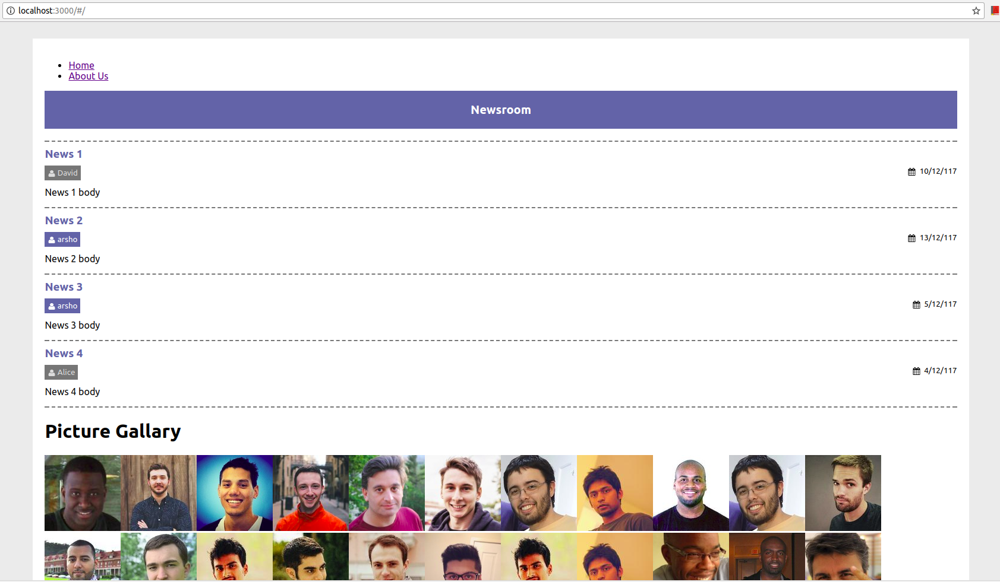

React
========



A web application using React JS
   
## Software Used

The following environment are used to develop the application:

- **OS** : Ubuntu 16.04 (64 bit)
- **IDE** : Atom

### Necessary Package Installation

- React packages are listed in package.json file

		$ python virtualenv venv

- Activate virtual environment (Change it based on your OS)

		$ source venv/bin/activate

- Install necessary packages included in requirements.txt

		$ pip install -r webapp/requirements.txt

Creating projects using React JS in Ubuntu
===========================================

### Install CURL
```
sudo apt-get install curl
```

### Install Node
```
sudo curl -sL https://deb.nodesource.com/setup_8.x | sudo -E bash -
sudo apt-get install -y nodejs
```

### Create and change to a directory
```
mkdir react_doc
cd react_doc
```

### Create react application installer
```
sudo npm install -g create-react-app
```

### Create new react project
```
create-react-app mate-app
```

### Change to app directory
```
cd mate-app
```

### Install dependencies
```
npm install
```

### To run app
```
npm start
```

